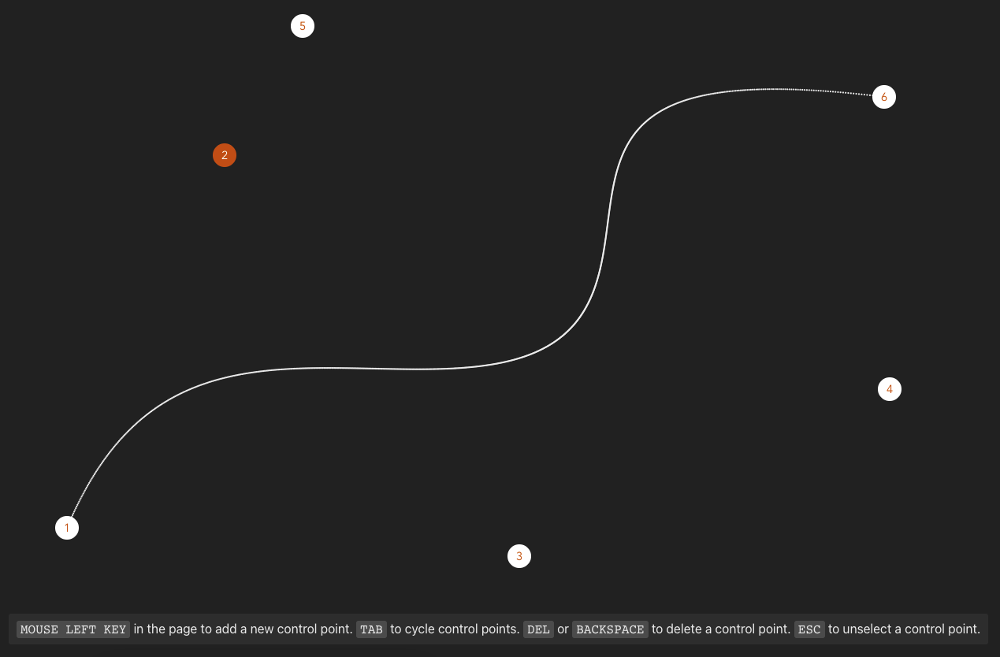

# `vite` / `typescript` interactive bazier curve playground



## Usage

Install dependencies and start the dev webserver.

```
pnpm install
pnpm dev
```

The following behaviour is implemented.

- click somewhere to add a new control point
- click on a point to select it
- hold the point to move it around
- press `delete` or `backspace` to delete a selected point
- press `escape` to stop a point selection
- press `tab` to cycle selection
